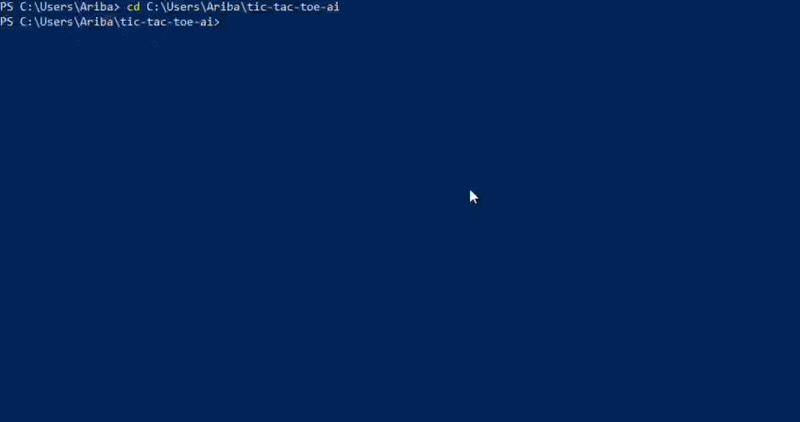

# 🎮 Tic-Tac-Toe with an Unbeatable AI

You play `X`. The computer plays `O`. But this isn't a "picks a random square 
and hopes" kind of AI — it's powered by the **Minimax algorithm**, which means 
it calculates every possible way the game could play out and always makes the 
optimal move.

Translation: you cannot beat it. Best case, you draw. Go ahead and try anyway. 😏

##  How it works

Minimax simulates the entire game tree from any given move — assuming you 
play your absolute best — and picks the outcome that's best for the AI. 
It's the same core idea behind real chess and checkers engines, just scaled 
way down to fit on a 3x3 grid.

##  How to run it

```bash
python game.py
```

Follow the prompts, pick a number 1–9, and watch the AI calmly dismantle 
your win condition.

##  What I learned building this

- Recursive algorithms & backtracking
- Game tree search (Minimax)
- Basic Python I/O and control flow
- Losing gracefully to code I wrote myself

## 🎥 Demo

📽️ Check out the demo below to see the AI in action!



---
## Author : **Ariba Khan**
